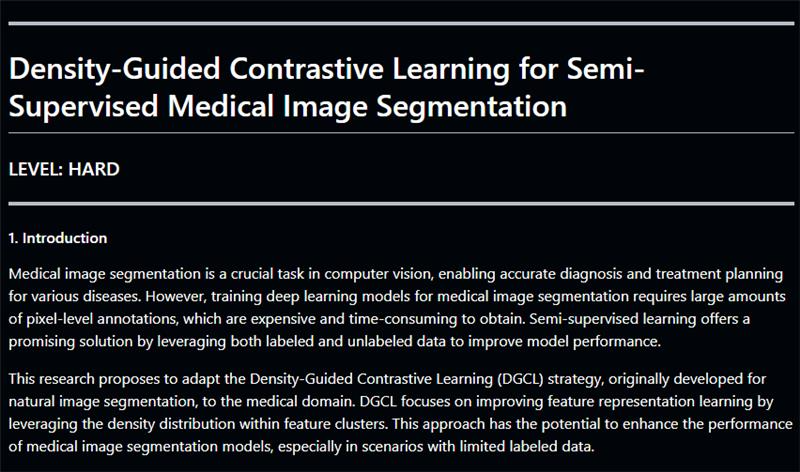

## Desity-Guided Contrastive Learning for Semi-Supervised Medical Image Segmentation

---

### 1. Phân tích yêu cầu của bài lab
- **Chủ đề:** Học đối nghịch có hướng dẫn mật độ (Density-Guided Contrastive Learning - DGCL) dành cho bài toán phân đoạn (segmentation) hình ảnh y tế trong bối cảnh bán giám sát.
- Đề cập rằng phương pháp được dùng để giảm phụ thuộc vào dữ liệu có nhãn bằng cách sử dụng cả dữ liệu có nhãn và dữ liệu không nhãn để cải thiện hiệu suất mô hình.
- Nhiệm vụ chính có thể là:
  1. **Triển khai, nghiên cứu và áp dụng thuật toán học đối nghịch DGCL.**
  2. **Phân đoạn hình ảnh y tế với một mô hình bán giám sát.**
  3. **Đánh giá hiệu suất của mô hình.**

---

### 2. Chuẩn bị môi trường làm việc
- **Công cụ cần thiết:**
  - Python với các thư viện như PyTorch hoặc TensorFlow/Keras.
  - Thư viện xử lý hình ảnh: OpenCV, SimpleITK, hoặc skimage.
  - Thư viện học sâu về đối nghịch (contrastive learning): [PyTorch Lightning](https://www.pytorchlightning.ai/) hoặc bất kỳ framework nào hỗ trợ contrastive learning layers.
  - Thư viện vẽ biểu đồ như Matplotlib hoặc Seaborn để trực quan hóa kết quả phân đoạn.
  
- **Dataset:**
  - Tìm kiếm và sử dụng một bộ dataset hình ảnh y tế (ví dụ: **Lung Segmentation Dataset, BRATS Dataset** hoặc **ISIC** cho phân đoạn hình ảnh y tế da).
  - Lưu ý: Chọn một phần nhỏ dữ liệu có nhãn và dùng phần còn lại để giả lập dữ liệu không nhãn.

---

### **3. Cách tiếp cận thực hiện**
#### **Bước 1: Khám phá lý thuyết về DGCL**
- Tìm tài liệu học thuật hoặc bài báo nghiên cứu có liên quan đến DGCL.
- Hiểu cách học đối nghịch hoạt động (contrastive learning) và cách DGCL mở rộng chiến lược này thông qua việc hướng dẫn mật độ (density guidance).

#### **Bước 2: Triển khai DGCL**
- **Xây dựng mô hình học sâu:**
  - Sử dụng encoder-decoder (ví dụ: U-Net hoặc SegNet) làm kiến trúc cho bài toán phân đoạn.
  - Kết hợp phương pháp contrastive learning: thêm các loss function như Contrastive Loss hoặc Triplet Loss để học mối liên hệ giữa các hình ảnh tương tự và không tương tự.

- **Hướng dẫn mật độ trong không gian đặc trưng:**
  - Tính toán phân phối mật độ dữ liệu trong không gian đặc trưng.
  - Sử dụng thông tin từ phân phối đó để điều kiện hóa loss function.

- **Fine-tune với dữ liệu có nhãn và không nhãn:**
  - Dữ liệu có nhãn sẽ được dùng để tối ưu Cross-Entropy Loss (supervised loss).
  - Dữ liệu không nhãn sẽ được dùng làm Contrastive Loss (một kiểu unsupervised loss).

#### **Bước 3: Thực nghiệm với dữ liệu**
- **Huấn luyện và kiểm tra:**
  - Huấn luyện mô hình với một tập dữ liệu có nhãn rất nhỏ (ví dụ: chỉ 10%-20% dữ liệu).
  - Dùng DGCL để tận dụng phần dữ liệu không nhãn còn lại.

- **Đánh giá hiệu suất:**
  - Dùng các chỉ số như Dice Coefficient, IoU (Intersection over Union), Precision, Recall để đánh giá chất lượng phân đoạn.

#### **Bước 4: So sánh kết quả**
- So sánh hiệu suất của mô hình với hoặc không có DGCL.
- Xem xét việc thay đổi kích thước tập dữ liệu có nhãn để đánh giá mô hình bán giám sát.

---

### **4. Báo cáo kết quả**
- **Cấu trúc gợi ý của báo cáo:**
  1. **Mở đầu:** Mục tiêu và ý nghĩa của bài toán.
  2. **Phương pháp:** Miêu tả DGCL và cách áp dụng vào bài toán phân đoạn hình ảnh y tế.
  3. **Thực nghiệm:** Dataset, quá trình huấn luyện, và các thông số quan trọng.
  4. **Kết quả:** Biểu đồ so sánh hiệu suất, ví dụ về hình ảnh phân đoạn.
  5. **Kết luận:** Hiệu quả của DGCL và bất kỳ cải tiến nào cần thiết.

---

### **5. Tài liệu tham khảo**
- Các bài báo hoặc tài liệu liên quan để hiểu thêm:
  - **"SimCLR: A Simple Framework for Contrastive Learning of Visual Representations"** - hiểu tổng quan về contrastive learning.
  - Các bài luận trên ArXiv hoặc PubMed liên quan đến DGCL trong image segmentation.

---
